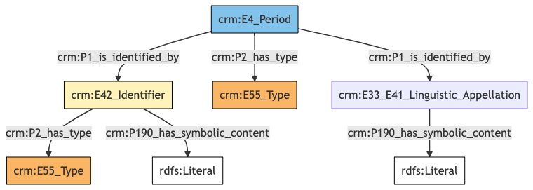
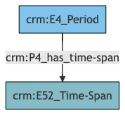
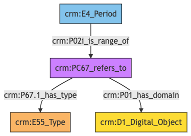

##**Period**##

**Author:** Denitsa Nenova, George Bruseker

**Version:** 1.0

The *Period* model is intended to enable the documentation and correct referencing of historical periods for use in datation. Typical instances of *Period* include period divisions of major epochs, as well as well known century divisions for periods of art history. Period is used primarily as a reference model.


| | Name| URI | 
|-|-----|-----|
|Root Ontology Node|E4 Period|https://cidoc-crm.org/Entity/E4-Period/version-7.1.1 |
|Type Differentiator|N/A|N/A|

**Model Sections Description**


|Information Category | Information Collections | Description | 
|---------------------|-------------------------|-------------|
|Names and Classifications    |Names/Alternative Names/Identifiers/Type|    The researcher can document various names and classification regarding the *Period* .|
|Existence |  Existence   | The researcher can document various free text descriptions of the *Period* .|
|Documentation  |Digital Object|   The researcher can document citations relative to the period, link to images related to period and document external URIs of documentation for the same *Period* .   | 

## Period **Names and Classifications**

The attribution of names and types to *Period* is a basic human activity. A chief factor in disambiguating which *Period* is referred to in historical texts is understanding the various names and identifiers that have been given to a *Period* at different moments. Likewise, additional classifiers of the *Period* help in the disambiguation, in an information system, of the reference to one *Period* from another.

| Filed ID    | Name                          | Description | Data Type | CRM Path |
| ----------- | ------------------------------|-------------|-----------|----------|
| LAF.6  |   Period Name |    This field is used to record the string value of the name attributed to the documented *Period* . |    String   |  ->p1->E33_E41[4_1]->p190->rdf:literal| 
| LAF.11  |   Period Type |    This field is used to record the formal type of the documented *Period* .  |   Concept  |   ->p2->E55[11_1]| 
| LAF.10  |   Period ID  |   This field is used to record an identifier attributed to the documented *Period* . |    String |    ->p1->E42[8_1]->p190->rdf:literal| 
| LAF.9  |   ID Type |    This field is used to record the type of the identifier attributed to the documented *Period* .  |   Concept  |   ->p1->E42[8_1]->p2->E55[9_1]| 

### - Period Names and Classifications **Ontology Graph**


### - Period Names and Classifications **RDF**

```
@prefix crm: <http://www.cidoc-crm.org/cidoc-crm/> .

<https://pma.us/models/period/E4> a crm:E4_Period ;
    crm:P1_is_identified_by <https://linked.art/example/conceptual_object/4_1>,
        <https://linked.art/example/conceptual_object/8_1> ;
    crm:P2_has_type <https://linked.art/example/type/11_1> .

<https://linked.art/example/conceptual_object/4_1> a crm:E33_E41_Linguistic_Appellation ;
    crm:P190_has_symbolic_content "Name_string_value" .

<https://linked.art/example/conceptual_object/8_1> a crm:E42_Identifier ;
    crm:P190_has_symbolic_content "Identifier_value_content" ;
    crm:P2_has_type <https://linked.art/example/identifier/9_1> .

<https://linked.art/example/identifier/9_1> a crm:E55_Type .

<https://linked.art/example/type/11_1> a crm:E55_Type .


                
```

### - Period Names and Classifications **JSON-LD**

```
{
  "@context": "https://linked.art/ns/v1/linked-art.json",
  "@graph": [
    {
      "id": "https://linked.art/example/identifier/9_1",
      "type": "Type"
    },
    {
      "classified_as": [
        "https://linked.art/example/identifier/9_1"
      ],
      "content": "Identifier_value_content",
      "id": "https://linked.art/example/conceptual_object/8_1",
      "type": "Identifier"
    },
    {
      "content": "Name_string_value",
      "id": "https://linked.art/example/conceptual_object/4_1",
      "type": "Name"
    },
    {
      "id": "https://linked.art/example/type/11_1",
      "type": "Type"
    },
    {
      "classified_as": [
        "https://linked.art/example/type/11_1"
      ],
      "id": "https://pma.us/models/period/E4",
      "identified_by": [
        "https://linked.art/example/conceptual_object/4_1",
        "https://linked.art/example/conceptual_object/8_1"
      ],
      "type": "Period"
    }
  ]
}
                
```


## Period **Existence**

Of essential importance in identifying *Periods* is their timespan outlining their existence.  

| Filed ID    | Name                          | Description | Data Type | CRM Path |
| ----------- | ------------------------------|-------------|-----------|----------|
|LAF.177  |  Period Timespan  |  This field is used to link the documented temporal periodto an instance of time-span recording the temporal extent of the period. |   Collection [Timespan]  |  ->P4->E52[177_1]|

### - Period Existence **Ontology Graph**


### - Period Existence **RDF**

```
@prefix crm: <http://www.cidoc-crm.org/cidoc-crm/> .

<https://pma.us/models/period/E4> a crm:E4_Period ;
    crm:P4_has_time-span <https://linked.art/example/time_span/177_1> .

<https://linked.art/example/time_span/177_1> a crm:E52_Time-Span .


                
```

### - Period Existence **JSON-LD**

```
{
  "@context": "https://linked.art/ns/v1/linked-art.json",
  "@graph": [
    {
      "id": "https://pma.us/models/period/E4",
      "timespan": "https://linked.art/example/time_span/177_1",
      "type": "Period"
    },
    {
      "id": "https://linked.art/example/time_span/177_1",
      "type": "TimeSpan"
    }
  ]
}
                
```

## Period **Documentation**

This information category unites referential information about the documented *Period*, providing contextual data about them.
 

| Filed ID    | Name                          | Description | Data Type | CRM Path |
| ----------- | ------------------------------|-------------|-----------|----------|
| PMAF.83  |   Digital Object |    This field is used to link to an instance of digital resource which serves as a digital reference document for the documented *Period*. |    Reference Model  [Digital Object]|   ->P02i->PC67[A83_1]->P01->D1[A83_2]| 
| PMAF.84 |    Digital Object Type |    This field is used to link to a type record which indicates the kind of reference supported by the digital resource that serves as a reference for the documented *Period*. |    Concept   |  ->P02i->PC67[A83_1]->P67.1->E55[A84_1]| 

### - Period Documentation **Ontology Graph**


### - Period Documentation **RDF**

```
@prefix crm: <http://www.cidoc-crm.org/cidoc-crm/> .

<https://pma.us/models/period/E4> a crm:E4_Period ;
    crm:P02i_is_range_of <https://linked.art/example/reified_property/A83_1> .

<https://linked.art/example/conceptual_object/A83_2> a crm:D1_Digital_Object .

<https://linked.art/example/conceptual_object/A84_1> a crm:E55_Type .

<https://linked.art/example/reified_property/A83_1> a crm:PC67_refers_to ;
    crm:P01_has_domain <https://linked.art/example/conceptual_object/A83_2> ;
    crm:P67.1_has_type <https://linked.art/example/conceptual_object/A84_1> .


                
```


### - Period Documentation **JSON-LD**

```
{
  "@context": "https://linked.art/ns/v1/linked-art.json",
  "@graph": [
    {
      "id": "https://linked.art/example/conceptual_object/A84_1",
      "type": "Type"
    },
    {
      "crm:P02i_is_range_of": {
        "id": "https://linked.art/example/reified_property/A83_1"
      },
      "id": "https://pma.us/models/period/E4",
      "type": "Period"
    },
    {
      "id": "https://linked.art/example/conceptual_object/A83_2",
      "type": "crm:D1_Digital_Object"
    },
    {
      "crm:P01_has_domain": {
        "id": "https://linked.art/example/conceptual_object/A83_2"
      },
      "crm:P67.1_has_type": {
        "id": "https://linked.art/example/conceptual_object/A84_1"
      },
      "id": "https://linked.art/example/reified_property/A83_1",
      "type": "crm:PC67_refers_to"
    }
  ]
}
                
```
