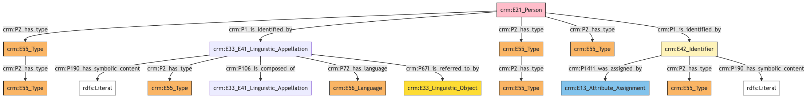
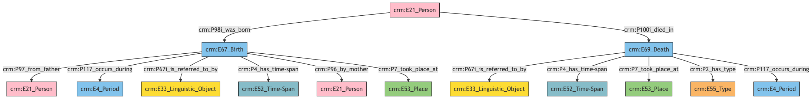
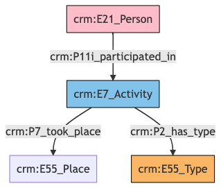
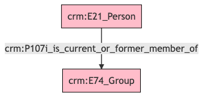
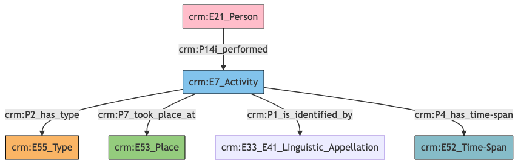
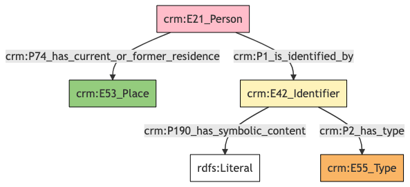
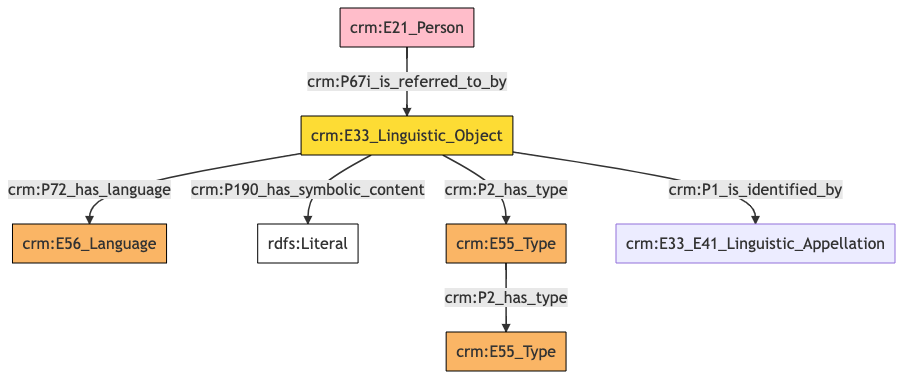
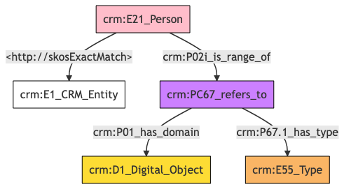

##**Person**##

**Author:** Denitsa Nenova, George Bruseker

**Version:** 1.0

The *Person* model is intended to enable the representation and sharing of data relevant to real-world, physical persons. It provides a list of standard fields that are typically present in the description of a *Person* in cultural heritage data systems. The intention of this reference model is to provide a consolidated, high-level formal structure comprising the most commonly reused descriptors for a *Person* entity and, further, to provide for these a set of semantic mapping to the CIDOC CRM. 


| | Name| URI | 
|-|-----|-----|
|Root Ontology Node|E21 Person |https://cidoc-crm.org/Entity/E21-Person/version-7.1.1 |
|Type Differentiator|N/A|N/A|

**Model Sections Description**

|Information Category | Information Collections | Description | 
|---------------------|-------------------------|-------------|
|Names and Classifications    |Names/Alternative Names/Identifiers/Type|   The researcher can document various names and classification regarding the *Person*.|
|Existence    |Birth/Death|    The researcher can document the events related to the birth and death of the *Person*.|
|Participation  | Role in Activity   | The researcher can document the participation of the *Person* in an activity of a type.|
|Actor Relations |Membership|    The researcher can document the membreship of the *Person* to a Group.|
|Activities | Profession|    The researcher can document information about the the professional activities of the *Person*.|
|Location |Contact Details|    The researcher can document relevant addresses and other contact information associated with the *Person*.|
|Description |   Description  |  The researcher can document various free-text descriptions of the *Person*.|
|Documentation    |Digital Resource|The researcher can document various weblinks and images related to the *Person*.|

## Person **Names and Classifications**
The attribution of names and types to *Persons* is a basic human activity. A chief factor in disambiguating which *Person* is referred to in historical texts is understanding the various names and identifiers that have been given to an individual at different moments. Likewise, additional classifiers of the individual as such, such as gender, help in the disambiguation, in an information system, of the reference to one real-world individual from another.

| Filed ID    | Name                          | Description | Data Type | CRM Path |
| ----------- | ------------------------------|-------------|-----------|----------|
|LAF.5 |   Name Type  |  This field is used to record the type of the name attributed to the documented *Person*.  |  Concept  |  ->p1->E33_41[4_1]->p2->E55[5_1]|
|LAF.6 |   Name   | This field is used to record the string value of the name attributed to the documented *Person*.  |  String   | ->p1->E33_E41[4_1]->p190->rdf:literal|
|LAF.7  |  Name Language  |  This field is used to record the language of the name attributed to the documented *Person*.  |  Concept  |  ->p1->E33_E41[4_1]->p72->E56[7_1]|
|LAF.44 |   Name Source |   This field is used to link to a source text in which the name denoting the documented *Person* is used. |   Reference Model  [Textual Work]|  ->p1->E33_E41[4_1]->p67i->E33[44_1]|
|LAF.500 |   Name Part  |  This field is used to link the documented name of *Person* to its relevant name part.  |  Collection [Name]  | ->p1->E33_41[4_1]->p106->E33_E41[500_1]|
|LAF.10  |  ID  |  This field is used to record an identifier attributed to the documented *Person*.  |  String  |  ->p1->E42[8_1]->p190->rdf:literal|
|LAF.9  |  ID Type |   This field is used to record the type of the identifier attributed to the documented *Person*. |   Concept   | ->p1->E42[8_1]->p2->E55[9_1]|
|LAF.434 |   ID Assigned By  |  This field is used to indicate the details of the data assignment of this identifier to the documented *Person*.  |  Collection [Data Assignment]|   ->p1->E42[8_1]->p141i->E13[434_1]|
|LAF.11  |  Classification |   This field is used to record the formal type of the documented *Person*.  |  Concept  |  ->p2->E55[11_1]|
|LAF.229  |  Nationality |   This field is used to record the nationality of the documented *Person*.  |  Concept  |  ->p2->E55[229_1]
->p2->E55[229_1]->p2->E55[229_2]|
|LAF.230 |   Gender  |  This field is used to record the gender of the documented *Person*. |   Concept |  ->p2->E55[230_1]->p2->E55[230_1]->p2->E55[230_2]|

### - Person Names and Classifications **Ontology Graph**


### - Person Names and Classifications **RDF**

```
@prefix crm: <http://www.cidoc-crm.org/cidoc-crm/> .
@prefix rdfs: <http://www.w3.org/2000/01/rdf-schema#> .

<https://pma.us/models/person/E21> a crm:E21_Person ;
    crm:P1_is_identified_by <https://linked.art/example/conceptual_object/4_1>,
        <https://linked.art/example/conceptual_object/8_1> ;
    crm:P2_has_type <https://linked.art/example/type/11_1>,
        <https://linked.art/example/type/229_1>,
        <https://linked.art/example/type/230_1> .

<http://vocab.getty.edu/page/aat/300379842> a crm:E55_Type ;
    rdfs:label "Nationality" .

<http://vocab.getty.edu/page/aat/300404670> a crm:E55_Type ;
    rdfs:label "preferred terms" .

<http://vocab.getty.edu/page/aat/300411835> a crm:E55_Type ;
    rdfs:label "Gender" .

<https://linked.art/example/conceptual_object/4_1> a crm:E33_E41_Linguistic_Appellation ;
    crm:P106_is_composed_of <https://linked.art/example/name/500_1> ;
    crm:P190_has_symbolic_content "Name_string_value" ;
    crm:P2_has_type <http://vocab.getty.edu/page/aat/300404670> ;
    crm:P67i_is_referred_to_by <https://linked.art/example/textual_object/44_1> ;
    crm:P72_has_language <https://linked.art/example/type/7_1> .

<https://linked.art/example/conceptual_object/8_1> a crm:E42_Identifier ;
    crm:P141i_was_assigned_by <https://linked.art/example/event/434_1> ;
    crm:P190_has_symbolic_content "Identifier_value_content" ;
    crm:P2_has_type <https://linked.art/example/identifier/9_1> .

<https://linked.art/example/event/434_1> a crm:E13_Attribute_Assignment .

<https://linked.art/example/identifier/9_1> a crm:E55_Type .

<https://linked.art/example/name/500_1> a crm:E33_E41_Linguistic_Appellation .

<https://linked.art/example/textual_object/44_1> a crm:E33_Linguistic_Object .

<https://linked.art/example/type/11_1> a crm:E55_Type .

<https://linked.art/example/type/229_1> a crm:E55_Type ;
    crm:P2_has_type <http://vocab.getty.edu/page/aat/300379842> .

<https://linked.art/example/type/230_1> a crm:E55_Type ;
    crm:P2_has_type <http://vocab.getty.edu/page/aat/300411835> .

<https://linked.art/example/type/7_1> a crm:E56_Language .


                
```

### - Person Names and Classifications **JSON-LD**

```
{
  "@context": "https://linked.art/ns/v1/linked-art.json",
  "@graph": [
    {
      "classified_as": [
        "https://linked.art/example/type/229_1",
        "https://linked.art/example/type/230_1",
        "https://linked.art/example/type/11_1"
      ],
      "id": "https://pma.us/models/person/E21",
      "identified_by": [
        "https://linked.art/example/conceptual_object/8_1",
        "https://linked.art/example/conceptual_object/4_1"
      ],
      "type": "Person"
    },
    {
      "_label": "Gender",
      "id": "http://vocab.getty.edu/page/aat/300411835",
      "type": "Type"
    },
    {
      "id": "https://linked.art/example/textual_object/44_1",
      "type": "LinguisticObject"
    },
    {
      "id": "https://linked.art/example/event/434_1",
      "type": "AttributeAssignment"
    },
    {
      "id": "https://linked.art/example/type/11_1",
      "type": "Type"
    },
    {
      "id": "https://linked.art/example/name/500_1",
      "type": "Name"
    },
    {
      "classified_as": [
        "http://vocab.getty.edu/page/aat/300404670"
      ],
      "content": "Name_string_value",
      "crm:P106_is_composed_of": {
        "id": "https://linked.art/example/name/500_1"
      },
      "id": "https://linked.art/example/conceptual_object/4_1",
      "language": [
        "https://linked.art/example/type/7_1"
      ],
      "referred_to_by": [
        "https://linked.art/example/textual_object/44_1"
      ],
      "type": "Name"
    },
    {
      "classified_as": [
        "http://vocab.getty.edu/page/aat/300411835"
      ],
      "id": "https://linked.art/example/type/230_1",
      "type": "Type"
    },
    {
      "_label": "preferred terms",
      "id": "http://vocab.getty.edu/page/aat/300404670",
      "type": "Type"
    },
    {
      "id": "https://linked.art/example/type/7_1",
      "type": "Language"
    },
    {
      "id": "https://linked.art/example/identifier/9_1",
      "type": "Type"
    },
    {
      "classified_as": [
        "http://vocab.getty.edu/page/aat/300379842"
      ],
      "id": "https://linked.art/example/type/229_1",
      "type": "Type"
    },
    {
      "_label": "Nationality",
      "id": "http://vocab.getty.edu/page/aat/300379842",
      "type": "Type"
    },
    {
      "assigned_by": [
        "https://linked.art/example/event/434_1"
      ],
      "classified_as": [
        "https://linked.art/example/identifier/9_1"
      ],
      "content": "Identifier_value_content",
      "id": "https://linked.art/example/conceptual_object/8_1",
      "type": "Identifier"
    }
  ]
}
                
```

## Person **Existence**
Of essential importance in identifying and tracking individuals is also their biographical information, such as their birth and death. For this reason, we have clustered descriptors relevant to such information into a common ‘existence’ category. These are described in the table below.

| Filed ID    | Name                          | Description | Data Type | CRM Path |
| ----------- | ------------------------------|-------------|-----------|----------|
|LAF.183  |  Death Place  |  This field is used to link the documented event of death of a *Person* to a location at which it occurred.|    Reference Model  [Place] | ->P100i->E69[183_1]->P7->E53[183_2]|
|LAF.184  |  Death Period  |  This field is used to link the documented event of death of a *Person* to the period during which it occurred.  |  Reference Model  [Period] | ->P100i->E69[183_1]->P117->E4[184_1]|
|LAF.187  |  Death Date  |  This field is used to link the documented event of death of a *Person* to an instance of time-span recording the temporal extent of the event.  |  Collection [Timespan]|   ->P100i->E69[183_1]->P4->E52[187_1]|
|LAF.188  |  Death Type |   This field is used to record the formal type of the documented event of death of a *Person*. |   Concept  |  ->P100i->E69[183_1]->P2->E55[188_1]|
|LAF.191 |   Death Notes |   This field is used to link the documented event of death of a *Person* to a statement that describes it. |   Collection  [Textual Work] | ->P100i->E69[183_1]->P67i->E33[191_1]|
|LAF.192 |   Birth Place |   This field is used to link the documented event of birth of a *Person* to a location at which it occurred. |   Reference Model [Place]  | ->P98i->E67[192_1]->P7->E53[192_2]|
|LAF.193 |   Birth Period |   This field is used to link the documented event of birth of a *Person* to the period during which it occurred. |   Reference Model  [Period] | ->P98i->E67[192_1]->P117->E4[193_1]|
|LAF.196 |   Birth Date   | This field is used to link the documented event of birth of a *Person* to an instance of time-span recording the temporal extent of the event. |   Collection  [Timespan]|  ->P98i->E67[192_1]->P4->E52[196_1]|
|LAF.200 |   Birth Notes |   This field is used to link the documented event of birth of a *Person* to a statement that describes it. |   Collection [Statement] |  ->P98i->E67[192_1]->P67i->E33[200_1]|
|PMAF.28 |   Mother |   This field is used to record the mother of the documented *Person*. |   Reference Model [Person] |  ->P98i->E67[192_1]->P96->E21[A28_1]|
|PMAF.29  |  Father |   This field is used to record the father of the documented *Person*. |   Reference Model [Person]|   ->P98i->E67[192_1]->P97->E21[A29_1]|

### - Person Existence **Ontology Graph**


### - Person Existence **RDF**

```
@prefix crm: <http://www.cidoc-crm.org/cidoc-crm/> .

<https://pma.us/models/person/E21> a crm:E21_Person ;
    crm:P100i_died_in <https://linked.art/example/event/183_1> ;
    crm:P98i_was_born <https://linked.art/example/event/192_1> .

<https://linked.art/example/actor/A28_1> a crm:E21_Person .

<https://linked.art/example/actor/A29_1> a crm:E21_Person .

<https://linked.art/example/conceptual_object/191_1> a crm:E33_Linguistic_Object .

<https://linked.art/example/conceptual_object/200_1> a crm:E33_Linguistic_Object .

<https://linked.art/example/event/183_1> a crm:E69_Death ;
    crm:P117_occurs_during <https://linked.art/example/event/184_1> ;
    crm:P2_has_type <https://linked.art/example/type/188_1> ;
    crm:P4_has_time-span <https://linked.art/example/time_span/187_1> ;
    crm:P67i_is_referred_to_by <https://linked.art/example/conceptual_object/191_1> ;
    crm:P7_took_place_at <https://linked.art/example/place/183_2> .

<https://linked.art/example/event/184_1> a crm:E4_Period .

<https://linked.art/example/event/192_1> a crm:E67_Birth ;
    crm:P117_occurs_during <https://linked.art/example/event/193_1> ;
    crm:P4_has_time-span <https://linked.art/example/time_span/196_1> ;
    crm:P67i_is_referred_to_by <https://linked.art/example/conceptual_object/200_1> ;
    crm:P7_took_place_at <https://linked.art/example/place/192_2> ;
    crm:P96_by_mother <https://linked.art/example/actor/A28_1> ;
    crm:P97_from_father <https://linked.art/example/actor/A29_1> .

<https://linked.art/example/event/193_1> a crm:E4_Period .

<https://linked.art/example/place/183_2> a crm:E53_Place .

<https://linked.art/example/place/192_2> a crm:E53_Place .

<https://linked.art/example/time_span/187_1> a crm:E52_Time-Span .

<https://linked.art/example/time_span/196_1> a crm:E52_Time-Span .

<https://linked.art/example/type/188_1> a crm:E55_Type .


                
```

### - Person Existence **JSON-LD**

```
{
  "@context": "https://linked.art/ns/v1/linked-art.json",
  "@graph": [
    {
      "id": "https://linked.art/example/type/188_1",
      "type": "Type"
    },
    {
      "born": "https://linked.art/example/event/192_1",
      "died": "https://linked.art/example/event/183_1",
      "id": "https://pma.us/models/person/E21",
      "type": "Person"
    },
    {
      "id": "https://linked.art/example/event/193_1",
      "type": "Period"
    },
    {
      "by_mother": "https://linked.art/example/actor/A28_1",
      "crm:P117_occurs_during": {
        "id": "https://linked.art/example/event/193_1"
      },
      "from_father": [
        "https://linked.art/example/actor/A29_1"
      ],
      "id": "https://linked.art/example/event/192_1",
      "referred_to_by": [
        "https://linked.art/example/conceptual_object/200_1"
      ],
      "timespan": "https://linked.art/example/time_span/196_1",
      "took_place_at": [
        "https://linked.art/example/place/192_2"
      ],
      "type": "Birth"
    },
    {
      "id": "https://linked.art/example/actor/A29_1",
      "type": "Person"
    },
    {
      "id": "https://linked.art/example/conceptual_object/191_1",
      "type": "LinguisticObject"
    },
    {
      "id": "https://linked.art/example/time_span/196_1",
      "type": "TimeSpan"
    },
    {
      "id": "https://linked.art/example/place/192_2",
      "type": "Place"
    },
    {
      "id": "https://linked.art/example/time_span/187_1",
      "type": "TimeSpan"
    },
    {
      "id": "https://linked.art/example/actor/A28_1",
      "type": "Person"
    },
    {
      "id": "https://linked.art/example/event/184_1",
      "type": "Period"
    },
    {
      "classified_as": [
        "https://linked.art/example/type/188_1"
      ],
      "crm:P117_occurs_during": {
        "id": "https://linked.art/example/event/184_1"
      },
      "id": "https://linked.art/example/event/183_1",
      "referred_to_by": [
        "https://linked.art/example/conceptual_object/191_1"
      ],
      "timespan": "https://linked.art/example/time_span/187_1",
      "took_place_at": [
        "https://linked.art/example/place/183_2"
      ],
      "type": "Death"
    },
    {
      "id": "https://linked.art/example/place/183_2",
      "type": "Place"
    },
    {
      "id": "https://linked.art/example/conceptual_object/200_1",
      "type": "LinguisticObject"
    }
  ]
}
                
```
## Person **Participation**
Of essential importance in identifying and tracking individuals is also their participation in different activities and their location.

| Filed ID    | Name                          | Description | Data Type | CRM Path |
| ----------- | ------------------------------|-------------|-----------|----------|
|PMAF.64  |  Role |   This field is used to document the type of activity in which the documented *Person* took part.   | Concept   | ->p11i->E7[A64_1]->p2->E55[A64_2]|
|PMAF.65 |   Activity Location  |  This field is used to document the location of an activity in which the documented *Person* took part.  |  Reference Model  [Place] |  ->p11i->E7[A64_1]->p7->E53[A65_1]|


### - Person Participation **Ontology Graph**


### - Person Participation **RDF**

```
@prefix crm: <http://www.cidoc-crm.org/cidoc-crm/> .

<https://pma.us/models/person/E21> a crm:E21_Person ;
    crm:P11i_participated_in <http://linked.art/example/event/A64_1> .

<http://linked.art/example/event/A64_1> a crm:E7_Activity ;
    crm:P2_has_type <http://linked.art/example/type/A64_2> ;
    crm:P7_took_place <http://linked.art/example/place/A65_1> .

<http://linked.art/example/place/A65_1> a crm:E55_Place .

<http://linked.art/example/type/A64_2> a crm:E55_Type .


                
```

### - Person Participation **JSON-LD**

```
{
  "@context": "https://linked.art/ns/v1/linked-art.json",
  "@graph": [
    {
      "id": "https://pma.us/models/person/E21",
      "participated_in": [
        "http://linked.art/example/event/A64_1"
      ],
      "type": "Person"
    },
    {
      "id": "http://linked.art/example/type/A64_2",
      "type": "Type"
    },
    {
      "id": "http://linked.art/example/place/A65_1",
      "type": "crm:E55_Place"
    },
    {
      "classified_as": [
        "http://linked.art/example/type/A64_2"
      ],
      "crm:P7_took_place": {
        "id": "http://linked.art/example/place/A65_1"
      },
      "id": "http://linked.art/example/event/A64_1",
      "type": "Activity"
    }
  ]
}
                
```
## Person **Actor Relations**
An area of documentation and potential disambiguation around the person relates to social relations, interpersonal or institutional. 


| Filed ID    | Name                          | Description | Data Type | CRM Path |
| ----------- | ------------------------------|-------------|-----------|----------|
|LAF.167  |  Member of  |  This field is used to link the documented *Person* to a broader group of which it is a member / forms a part.  |  Reference Model  [Group] | ->P107i->E74[167_1]|


### - Person Actor Relations **Ontology Graph**


### - Person Actor Relations **RDF**

```
@prefix crm: <http://www.cidoc-crm.org/cidoc-crm/> .

<https://pma.us/models/person/E21> a crm:E21_Person ;
    crm:P107i_is_current_or_former_member_of <https://linked.art/example/actor/167_1> .

<https://linked.art/example/actor/167_1> a crm:E74_Group .
```

### - Person Actor Relations **JSON-LD**

```
{
  "@context": "https://linked.art/ns/v1/linked-art.json",
  "@graph": [
    {
      "crm:P107i_is_current_or_former_member_of": {
        "id": "https://linked.art/example/actor/167_1"
      },
      "id": "https://pma.us/models/person/E21",
      "type": "Person"
    },
    {
      "id": "https://linked.art/example/actor/167_1",
      "type": "Group"
    }
  ]
}
                
```


## Person **Activities**
An important area of documentation and potential disambiguation around the *Person* relates to their professional activities. 


| Filed ID    | Name                          | Description | Data Type | CRM Path |
| ----------- | ------------------------------|-------------|-----------|----------|
|LAF.126 |   Work Place  |  This field is used to link the documented *Person*'s professional activity to a location at which it was carried out.  |  Reference Model  [Place] | ->P14i->E7[126_1]->P7->E53[126_2]|
|LAF.131  |  Profession  |  This field is used to link the documented *Person*'s professional activity to a name that has been attributed to it.  |  Collection [Statement] |   ->P14i->E7[126_1]->P1->E33_E41[131_1]|
|LAF.133 |   Profession Practices Dates |   This field is used to link the documented *Person*'s professional activity to an instance of time-span recording the temporal extent of the activity.|    Collection  [Timespan] | ->P14i->E7[126_1]->P4->E52[133_1]|
|LAF.134  |  Profession Type |   This field is used to record the formal type of the documented *Person*'s professional activity. |   Concept   | ->P14i->E7[126_1]->P2->E55[134_1]|


### - Person Works **Ontology Graph**


### - Person Works **RDF**

```
@prefix crm: <http://www.cidoc-crm.org/cidoc-crm/> .

<https://pma.us/models/person/E21> a crm:E21_Person ;
    crm:P14i_performed <https://linked.art/example/event/126_1> .

<https://linked.art/example/event/126_1> a crm:E7_Activity ;
    crm:P1_is_identified_by <https://linked.art/example/name/131_1> ;
    crm:P2_has_type <https://linked.art/example/type/134_1> ;
    crm:P4_has_time-span <https://linked.art/example/time_span/133_1> ;
    crm:P7_took_place_at <https://linked.art/example/place/126_2> .

<https://linked.art/example/name/131_1> a crm:E33_E41_Linguistic_Appellation .

<https://linked.art/example/place/126_2> a crm:E53_Place .

<https://linked.art/example/time_span/133_1> a crm:E52_Time-Span .

<https://linked.art/example/type/134_1> a crm:E55_Type .


```
### - Person Works **JSON-LD**

```
{
  "@context": "https://linked.art/ns/v1/linked-art.json",
  "@graph": [
    {
      "carried_out": [
        "https://linked.art/example/event/126_1"
      ],
      "id": "https://pma.us/models/person/E21",
      "type": "Person"
    },
    {
      "classified_as": [
        "https://linked.art/example/type/134_1"
      ],
      "id": "https://linked.art/example/event/126_1",
      "identified_by": [
        "https://linked.art/example/name/131_1"
      ],
      "timespan": "https://linked.art/example/time_span/133_1",
      "took_place_at": [
        "https://linked.art/example/place/126_2"
      ],
      "type": "Activity"
    },
    {
      "id": "https://linked.art/example/time_span/133_1",
      "type": "TimeSpan"
    },
    {
      "id": "https://linked.art/example/type/134_1",
      "type": "Type"
    },
    {
      "id": "https://linked.art/example/name/131_1",
      "type": "Name"
    },
    {
      "id": "https://linked.art/example/place/126_2",
      "type": "Place"
    }
  ]
}
                
```

## Person **Contact Point**
An important area of documentation and potential disambiguation around the *Person* relates to the contact information of real individuals. This normally involves the recording of the current address and another prefered form of communication with the documented *Person*.

| Filed ID    | Name                          | Description | Data Type | CRM Path |
| ----------- | ------------------------------|-------------|-----------|----------|
|LAF.172  |  Current Address |   This field is used to link the documented *Person* to a place at which they have been resident.  |  Reference Model [Place]  | ->P74->E53[172_1]|
|LAF.169  |  Contact Point Type  |  This field is used to record the type of the contact Point attributed to the documented *Person*. |   Concept   | ->P1->E42[168_1]->P2->E55[169_1]|
|LAF.170  |  Contact Details  |  This field is used to record a contact Point attributed to the documented *Person*. |   String   | ->P1->E42[168_1]->P190->rdf:literal|


### - Person Contact Point **Ontology Graph**


### - Person Contact Point **RDF**

```
@prefix crm: <http://www.cidoc-crm.org/cidoc-crm/> .

<https://pma.us/models/person/E21> a crm:E21_Person ;
    crm:P1_is_identified_by <https://linked.art/example/conceptual_object/168_1> ;
    crm:P74_has_current_or_former_residence <https://linked.art/example/place/172_1> .

<https://linked.art/example/conceptual_object/168_1> a crm:E42_Identifier ;
    crm:P190_has_symbolic_content "Identifier_value_content" ;
    crm:P2_has_type <https://linked.art/example/type/169_1> .

<https://linked.art/example/place/172_1> a crm:E53_Place .

<https://linked.art/example/type/169_1> a crm:E55_Type .

```

### - Person Contact Point **JSON-LD**

```
{
  "@context": "https://linked.art/ns/v1/linked-art.json",
  "@graph": [
    {
      "id": "https://pma.us/models/person/E21",
      "identified_by": [
        "https://linked.art/example/conceptual_object/168_1"
      ],
      "residence": [
        "https://linked.art/example/place/172_1"
      ],
      "type": "Person"
    },
    {
      "id": "https://linked.art/example/type/169_1",
      "type": "Type"
    },
    {
      "id": "https://linked.art/example/place/172_1",
      "type": "Place"
    },
    {
      "classified_as": [
        "https://linked.art/example/type/169_1"
      ],
      "content": "Identifier_value_content",
      "id": "https://linked.art/example/conceptual_object/168_1",
      "type": "Identifier"
    }
  ]
}
                
```
                
## Person **Description**
This category brings together the diverse field which describes the documented *Person*. It is meant to cover information concerning the type, language content of the description as well as temporal information about the description itself.

| Filed ID    | Name                          | Description | Data Type | CRM Path |
| ----------- | ------------------------------|-------------|-----------|----------|
|LAF.14 |   Statement Type  |  This field is used to record the formal type of the statement made about the documented *Person*. |   Concept   | ->p67i->E33[13_1]->p2->E55[14_1]|
|LAF.15  |  Statement|    This field is used to record the actual textual content of the statement describing the documented *Person*.  |  String  |  ->p67i->E33[13_1]->p190->rdf:literal|
|LAF.16 |   Statement Language |   This field is used to record the language of the statement describing the documented *Person*. |   Concept   | ->p67i->E33[13_1]->p72->E56[16_1]|
|LAF.50 |   Statement Name  |  This field is used to link to a name attributed to the statement made about the documented *Person*. |   Collection [Name] |  ->p67i->E33[13_1]->p1->E33_E41[50_1]|


### - Person Description **Ontology Graph**


### - Person Description **RDF**

```
@prefix crm: <http://www.cidoc-crm.org/cidoc-crm/> .

<https://pma.us/models/person/E21> a crm:E21_Person ;
    crm:P67i_is_referred_to_by <https://linked.art/example/conceptual_object/13_1> .

<http://vocab.getty.edu/aat/300418049> a crm:E55_Type .

<https://linked.art/example/conceptual_object/13_1> a crm:E33_Linguistic_Object ;
    crm:P190_has_symbolic_content "Statement_string_content" ;
    crm:P1_is_identified_by <https://linked.art/example/name/50_1> ;
    crm:P2_has_type <https://linked.art/example/type/14_1> ;
    crm:P72_has_language <https://linked.art/example/type/16_1> .

<https://linked.art/example/name/50_1> a crm:E33_E41_Linguistic_Appellation .

<https://linked.art/example/type/14_1> a crm:E55_Type ;
    crm:P2_has_type <http://vocab.getty.edu/aat/300418049> .

<https://linked.art/example/type/16_1> a crm:E56_Language .


                
```


### - Person Description **JSON-LD**

```
{
  "@context": "https://linked.art/ns/v1/linked-art.json",
  "@graph": [
    {
      "id": "https://pma.us/models/person/E21",
      "referred_to_by": [
        "https://linked.art/example/conceptual_object/13_1"
      ],
      "type": "Person"
    },
    {
      "id": "http://vocab.getty.edu/aat/300418049",
      "type": "Type"
    },
    {
      "id": "https://linked.art/example/type/16_1",
      "type": "Language"
    },
    {
      "classified_as": [
        "http://vocab.getty.edu/aat/300418049"
      ],
      "id": "https://linked.art/example/type/14_1",
      "type": "Type"
    },
    {
      "classified_as": [
        "https://linked.art/example/type/14_1"
      ],
      "content": "Statement_string_content",
      "id": "https://linked.art/example/conceptual_object/13_1",
      "identified_by": [
        "https://linked.art/example/name/50_1"
      ],
      "language": [
        "https://linked.art/example/type/16_1"
      ],
      "type": "LinguisticObject"
    },
    {
      "id": "https://linked.art/example/name/50_1",
      "type": "Name"
    }
  ]
}
                

```

## Person **Documentation**
This information category unites referential information about the documented *Person*, providing contextual data about them.

| Filed ID    | Name                          | Description | Data Type | CRM Path |
| ----------- | ------------------------------|-------------|-----------|----------|
|LAF.37  |  Same As  |  This field is used to document a URI which is meant to indicate an equivalence between the documented *Person* and a resolvable, structured reference resource that stands as a document for this self same entity. |   Class  |  ->skos:ExactMatch->E1[37_1]|
|PMAF.84  |  Digital Object Type   | This field is used to link to a type record which indicates the kind of reference supported by the digital resource that serves as a reference for the documented *Person*.  |  Concept  | ->P02i->PC67[A83_1]->P67.1->E55[A84_1]|
|PMAF.83 |   Digital Object   | This field is used to link to an instance of digital resource which serves as a digital reference document for the documented *Person*.  |  Reference Model [Digital Object]  |  ->P02i->PC67[A83_1]->P01->D1[A83_2]|

### - Person Documentaion **Ontology Graph**


### - Person Documentaion **RDF**

```
@prefix crm: <http://www.cidoc-crm.org/cidoc-crm/> .
@prefix skos: <http://skos> .

<https://pma.us/models/person/E21> a crm:E21_Person ;
    skos:ExactMatch <https://linked.art/example/entity/37_1> ;
    crm:P02i_is_range_of <https://linked.art/example/reified_property/A83_1> .

<https://linked.art/example/conceptual_object/A83_2> a crm:D1_Digital_Object .

<https://linked.art/example/conceptual_object/A84_1> a crm:E55_Type .

<https://linked.art/example/entity/37_1> a crm:E1_CRM_Entity .

<https://linked.art/example/reified_property/A83_1> a crm:PC67_refers_to ;
    crm:P01_has_domain <https://linked.art/example/conceptual_object/A83_2> ;
    crm:P67.1_has_type <https://linked.art/example/conceptual_object/A84_1> .


                
```

### - Person Documentaion **JSON-LD**

```
{
  "@context": "https://linked.art/ns/v1/linked-art.json",
  "@graph": [
    {
      "crm:P02i_is_range_of": {
        "id": "https://linked.art/example/reified_property/A83_1"
      },
      "http://skosExactMatch": {
        "id": "https://linked.art/example/entity/37_1"
      },
      "id": "https://pma.us/models/person/E21",
      "type": "Person"
    },
    {
      "id": "https://linked.art/example/conceptual_object/A83_2",
      "type": "crm:D1_Digital_Object"
    },
    {
      "crm:P01_has_domain": {
        "id": "https://linked.art/example/conceptual_object/A83_2"
      },
      "crm:P67.1_has_type": {
        "id": "https://linked.art/example/conceptual_object/A84_1"
      },
      "id": "https://linked.art/example/reified_property/A83_1",
      "type": "crm:PC67_refers_to"
    },
    {
      "id": "https://linked.art/example/conceptual_object/A84_1",
      "type": "Type"
    },
    {
      "id": "https://linked.art/example/entity/37_1",
      "type": "CRMEntity"
    }
  ]
}
                
```
