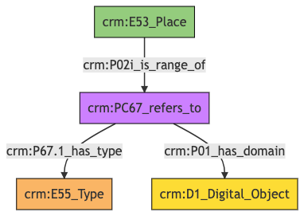

##**Place**##

**Author:** Denitsa Nenova, George Bruseker

**Version:** 1.0

The *Place* model is intended to enable the representation and sharing of data relevant to geographic places used to identify the locations of items and events over time. Typical instances of *Place*  are cities, states and countries, but also buildings, rooms, shelves, etc. The *Place* model is intended solely for the documentation of real, geometrically definable *Places*. In the context of the CSDM, it is used primarily as a reference model.


| | Name| URI | 
|-|-----|-----|
|Root Ontology Node|E53 Place|https://cidoc-crm.org/Entity/E53-Place/version-7.1.1 |
|Type Differentiator|N/A|N/A|

**Model Sections Description**

|Information Category | Information Collections | Description | 
|---------------------|-------------------------|-------------|
|Names and Classifications    |Names/Alternative Names/Identifiers/Type|   The researcher can document various names and classification regarding the *Place*.|
|Parthood  |  Membership |   The researcher can document the membership of the *Place*.|
|Documentation  |Digital Object|   The researcher can document citations relative to the *Place*, link to images of the place and document external URIs of documentation for the same *Place*.   |     
                                                                                                    
## Place **Names and Classifications**

The attribution of names and types to a *Place*, as with other entities, is a basic human activity. A chief factor in disambiguating *Places* lies in understanding the various names and identifiers that have been given to them at different moments in their individual histories. Historical *Places* often receive different names according to the groups naming it, as well as receiving different kinds of names according to contexts and during different historical moments. Likewise, additional classifiers of a *Place*, such as how it is has been formally classified, give important distinguishing characteristics. Because the type of a *Place* is a socially related factor, dependent on how the *Place* is appropriated/used in human interaction, the type of a place may change over time. In the model we add the possibility for describing this shift.

| Filed ID    | Name                          | Description | Data Type | CRM Path |
| ----------- |------------------------------|-------------|-----------|----------|
|LAF.6 |   Place Name |   This field is used to record the string value of the name attributed to the documented *Place*. |   String   | ->p1->E33_E41[4_1]->p190->rdf:literal|
|LAF.11  |  Place Type  |  This field is used to record the formal type of the documented *Place*.|    Concept |   ->p2->E55[11_1]|
|LAF.10  |  Place ID   | This field is used to record an identifier attributed to the documented *Place*.  |  String |   ->p1->E42[8_1]->p190->rdf:literal|
|LAF.9  |  ID Type |   This field is used to record the type of the identifier attributed to the documented *Place*.  |  Concept  |  ->p1->E42[8_1]->p2->E55[9_1]|

### - Place Names and Classifications **Ontology Graph**


### - Place Names and Classifications **RDF**

```
@prefix crm: <http://www.cidoc-crm.org/cidoc-crm/> .

<https://pma.us/models/place/E53> a crm:E53_Place ;
    crm:P1_is_identified_by <https://linked.art/example/conceptual_object/4_1>,
        <https://linked.art/example/conceptual_object/8_1> ;
    crm:P2_has_type <https://linked.art/example/type/11_1> .

<https://linked.art/example/conceptual_object/4_1> a crm:E33_E41_Linguistic_Appellation ;
    crm:P190_has_symbolic_content "Name_string_value" .

<https://linked.art/example/conceptual_object/8_1> a crm:E42_Identifier ;
    crm:P190_has_symbolic_content "Identifier_value_content" ;
    crm:P2_has_type <https://linked.art/example/identifier/9_1> .

<https://linked.art/example/identifier/9_1> a crm:E55_Type .

<https://linked.art/example/type/11_1> a crm:E55_Type .


                
```

### - Place Names and Classifications **JSON-LD**

```
{
  "@context": "https://linked.art/ns/v1/linked-art.json",
  "@graph": [
    {
      "content": "Name_string_value",
      "id": "https://linked.art/example/conceptual_object/4_1",
      "type": "Name"
    },
    {
      "classified_as": [
        "https://linked.art/example/identifier/9_1"
      ],
      "content": "Identifier_value_content",
      "id": "https://linked.art/example/conceptual_object/8_1",
      "type": "Identifier"
    },
    {
      "id": "https://linked.art/example/identifier/9_1",
      "type": "Type"
    },
    {
      "id": "https://linked.art/example/type/11_1",
      "type": "Type"
    },
    {
      "classified_as": [
        "https://linked.art/example/type/11_1"
      ],
      "id": "https://pma.us/models/place/E53",
      "identified_by": [
        "https://linked.art/example/conceptual_object/8_1",
        "https://linked.art/example/conceptual_object/4_1"
      ],
      "type": "Place"
    }
  ]
}
                
```


## Place **Parthood**

The mereo-topological breakdown of *Places* is crucial to understanding the relative relations between *Places*. This information category gathers together the basic descriptors typically deployed to this end. In the study and documentation of a *Place*, this is a highly researched topic with extremely fine grained analysis available. In this base model, we represent the relation of one *Place* falling within another. This representation allows both for documentation of contemporaneous containment relations but also the expression of a *Place* falling within another *Place* or containing one at a particular historical time.

| Filed ID    | Name                          | Description | Data Type | CRM Path |
| ----------- |------------------------------|-------------|-----------|----------|
|LAF.29   | Parent Location  |  This field is used to record the broader *Place* to which the documented *Place* belongs as part. |   Reference Model [Place]  | ->p89->E53[29_1]|

### - Place Parthood **Ontology Graph**


### - Place Parthood **RDF**

```
@prefix crm: <http://www.cidoc-crm.org/cidoc-crm/> .

<https://pma.us/models/place/E53> a crm:E53_Place ;
    crm:P89_falls_within <https://linked.art/example/place/29_1> .

<https://linked.art/example/place/29_1> a crm:E53_Place .


                
```

### - Place Parthood **JSON-LD**

```
{
  "@context": "https://linked.art/ns/v1/linked-art.json",
  "@graph": [
    {
      "id": "https://linked.art/example/place/29_1",
      "type": "Place"
    },
    {
      "crm:P89_falls_within": {
        "id": "https://linked.art/example/place/29_1"
      },
      "id": "https://pma.us/models/place/E53",
      "type": "Place"
    }
  ]
}
                
```


## Place **Documentation**

This information category unites referential information about the documented *Place*, providing contextual data about it.

| Filed ID    | Name                          | Description | Data Type | CRM Path |
| ----------- |------------------------------|-------------|-----------|----------|
|PMAF.83  |  Digital Object |   This field is used to link to an instance of digital resource which serves as a digital reference document for the documented *Place*. |   Reference Model [Digital Object]|   ->P02i->PC67[A83_1]->P01->D1[A83_2]|
|PMAF.84  |  Digital Object Type  |  This field is used to link to a type record which indicates the kind of reference supported by the digital resource that serves as a reference for the documented *Place*. |   Concept   | ->P02i->PC67[A83_1]->P67.1->E55[A84_1]|

### - Place Documentation **Ontology Graph**


### - Place Documentation **RDF**

```
@prefix crm: <http://www.cidoc-crm.org/cidoc-crm/> .

<https://pma.us/models/place/E53> a crm:E53_Place ;
    crm:P02i_is_range_of <https://linked.art/example/reified_property/A83_1> .

<https://linked.art/example/conceptual_object/A83_2> a crm:D1_Digital_Object .

<https://linked.art/example/conceptual_object/A84_1> a crm:E55_Type .

<https://linked.art/example/reified_property/A83_1> a crm:PC67_refers_to ;
    crm:P01_has_domain <https://linked.art/example/conceptual_object/A83_2> ;
    crm:P67.1_has_type <https://linked.art/example/conceptual_object/A84_1> .


                
```

### - Place Documentation **JSON-LD**

```
{
  "@context": "https://linked.art/ns/v1/linked-art.json",
  "@graph": [
    {
      "id": "https://linked.art/example/conceptual_object/A84_1",
      "type": "Type"
    },
    {
      "crm:P02i_is_range_of": {
        "id": "https://linked.art/example/reified_property/A83_1"
      },
      "id": "https://pma.us/models/place/E53",
      "type": "Place"
    },
    {
      "id": "https://linked.art/example/conceptual_object/A83_2",
      "type": "crm:D1_Digital_Object"
    },
    {
      "crm:P01_has_domain": {
        "id": "https://linked.art/example/conceptual_object/A83_2"
      },
      "crm:P67.1_has_type": {
        "id": "https://linked.art/example/conceptual_object/A84_1"
      },
      "id": "https://linked.art/example/reified_property/A83_1",
      "type": "crm:PC67_refers_to"
    }
  ]
}
                
```
