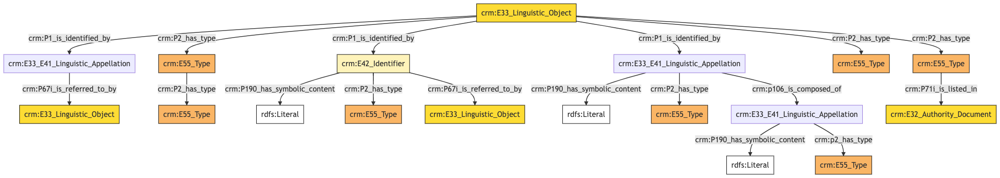
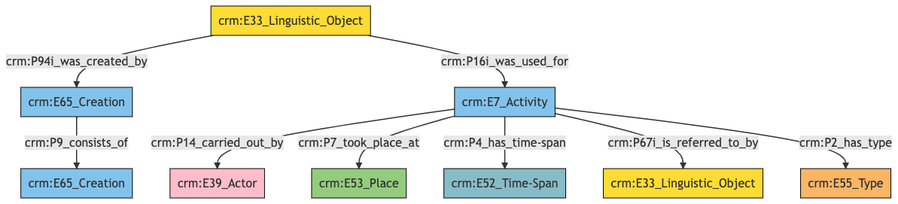
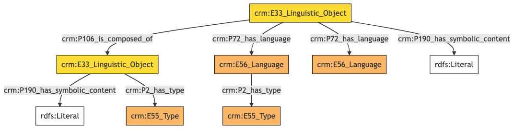
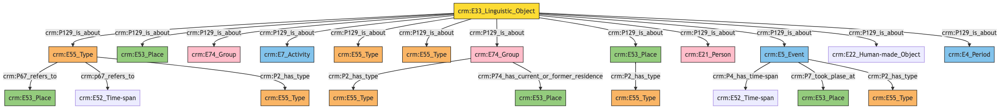
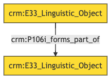
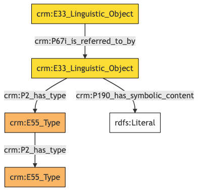
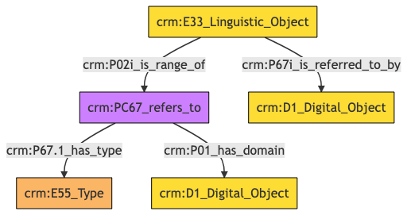

##**Textual Work**##

**Author:** Denitsa Nenova, George Bruseker

**Version:** 1.0

The *Textual Work* model is intended to enable the representation and reference of data relevant to bibliographic sources that have been used in the course of researching and documenting, as well as the documentation of artwork conservation processes in what is known as conservation reports. The textual reference data model offers a list of standard fields often used in the general description of a *Textual Work*. It also provides a number of additional conservation specific fields expressing knowledge from the point of view of documented conservation activities. The scope of this model is the *Textual Work* in general as information object and pointer to real world instances of an actual publication or the documentation of a conservation report.


| | Name| URI | 
|-|-----|-----|
|Root Ontology Node|E33 Linguistic Object|https://cidoc-crm.org/Entity/E33-Linguistic-Object/version-7.1.1 |
|Type Differentiator|texts (documents)|http://vocab.getty.edu/aat/300263751 |


**Model Sections Description**

|Information Category | Information Collections | Description | 
|---------------------|-------------------------|-------------|
| Names and Classifications |   Names/Identifiers/Type  |  The researcher can document various names and identifiers regarding the *Textual Work* as well as the generic type of the work.|
|Existence   | Publication/Contirbution|   The researcher can document the events related to the publication of an *Textual Work* and various contributors helping bring the work to existence.|
|Substance   | Language/Content/Definition | The researcher can document various content information about the *Textual Work* such as content or the language of the content.|
|Actor Relations | Acquisition Actors | The researcher can document variuos relationships between the *Textual Work* and an actor such as donors.|
|Aboutness  | Subject |   The researcher can document a variety of subject information embedded in the content of the *Textual Work* such as geographical or topical references.|
|Description  |  Description |   The researcher can document various free-text descriptions about the *Textual Work* such as physical description of the carrier of the textual content.|
|Documentation  |  Digital Reference | The researcher can document digital objects such as images and weblinks relative to the *Textual Work* |

## Textual Work **Names and Classifications**

The attribution of names and types to a *Textual Work*, as with other entities, is a basic human activity. A chief factor in disambiguating objects lies in understanding the various names and identifiers that have been given to them at different moments in their individual histories. Likewise, additional classifiers of the *Textual Work* give important distinguishing characteristics.

| Filed ID    | Name                          | Description | Data Type | CRM Path |
| ----------- | ------------------------------|-------------|-----------|----------|
|PMAF.77  |  Textual Work Type|    This field is used to document a formal top level concept describing the documented *Textual Work*, such as library resource or conservation report. |   Concept |   ->p2->E55[77_1]->p2->E55->p2->E55[77_2]|
|LAF.10  |  Identifier  |  This field is used to record an identifier attributed to the documented *Textual Work*.  |  String  |  ->p1->E42[8_1]->p190->rdf:literal|
|LAF.9 |   Identifier Type |   This field is used to record the type of the identifier attributed to the documented *Textual Work*. |   Concept   | ->p1->E42[8_1]->p2->E55[9_1]|
|LAF.45  |  Identifier Source |   This field is used to link to a source text in which the identifier denoting the documented *Textual Work* is used.  |  Reference Model [Textual Work]|   ->p1->E42[8_1]->p67i->E33[45_1]|
|LAF.6  |  Title |   This field is used to record the string value of the name attributed to the documented *Textual Work*. |   String  |  ->p1->E33_E41[4_1]->p190->rdf:literal|
|LAF.5 |   Title Type |   This field is used to record the type of the name attributed to the documented *Textual Work*.  |  Concept |   ->p1->E33_41[4_1]->p2->E55[5_1]|
|PMAF.26 |   Title Note  |  This field is used to record a general statement about a name of the documented *Textual Work*. |   Collection  [Statement]|  ->P1->E33_E41[A26_1]->P67i->E33[A26_2]|
|LAF.35  |  Subtitle |   This field is used to record the string value of the name part attributed to the documented *Textual Work*. |   String  |  ->p1->E33_E41[4_1]->p106->E33_E41[35_1]->p190->rdf:literal|
|LAF.34  |  Subtitle Type   | This field is used to record the type of the name part attributed to the documented *Textual Work*. |   Concept   | ->p1->E33_E41[4_1]->p106->E33_41[33_1]->p2->E55[34_1]|
|LAF.11  |  Index Term--Genre/Form |   This field is used to record the formal type of the documented *Textual Work*. |   Concept |   ->p2->E55[11_1]|
|PMAF.59  |  Form/Genre: Term Source  |   This field is used to document location of group mentioned in the content of the documented *Textual Work*. |   URL   | ->p2->E55[A11_1]->p71i-E32[A59_2]|

### - Textual Work Names and Classifications **Ontology Graph**



### - Textual Work Names and Classifications **RDF**

```
@prefix crm: <http://www.cidoc-crm.org/cidoc-crm/> .
@prefix rdfs: <http://www.w3.org/2000/01/rdf-schema#> .

<https://pma.us/models/textual_work/E33> a crm:E33_Linguistic_Object ;
    crm:P1_is_identified_by <https://linked.art/example/conceptual_object/4_1>,
        <https://linked.art/example/conceptual_object/8_1>,
        <https://pma.us/appellation/A26_1> ;
    crm:P2_has_type <http://pma.us/conceptual_object/A77_1>,
        <http://pma.us/type/A11_1>,
        <https://linked.art/example/type/11_1> .

<http://pma.us/conceptual_object/A77_1> a crm:E55_Type ;
    crm:P2_has_type <http://vocab.getty.edu/page/aat/300137955> .

<http://pma.us/linguistic_object/A59_2> a crm:E32_Authority_Document .

<http://pma.us/type/A11_1> a crm:E55_Type ;
    crm:P71i_is_listed_in <http://pma.us/linguistic_object/A59_2> .

<http://vocab.getty.edu/page/aat/300137955> a crm:E55_Type ;
    rdfs:label "Resource Type" .

<http://vocab.getty.edu/page/aat/300404670> a crm:E55_Type ;
    rdfs:label "preferred terms" .

<https://linked.art/example/conceptual_object/4_1> a crm:E33_E41_Linguistic_Appellation ;
    crm:P190_has_symbolic_content "Name_string_value" ;
    crm:P2_has_type <http://vocab.getty.edu/page/aat/300404670> ;
    crm:p106_is_composed_of <https://linked.art/example/name/33_1> .

<https://linked.art/example/conceptual_object/8_1> a crm:E42_Identifier ;
    crm:P190_has_symbolic_content "Identifier_value_content" ;
    crm:P2_has_type <https://linked.art/example/identifier/9_1> ;
    crm:P67i_is_referred_to_by <https://linked.art/example/textual_object/45_1> .

<https://linked.art/example/identifier/9_1> a crm:E55_Type .

<https://linked.art/example/name/33_1> a crm:E33_E41_Linguistic_Appellation ;
    crm:P190_has_symbolic_content "content goes here" ;
    crm:p2_has_type <https://linked.art/example/type/34_1> .

<https://linked.art/example/textual_object/45_1> a crm:E33_Linguistic_Object .

<https://linked.art/example/type/11_1> a crm:E55_Type .

<https://linked.art/example/type/34_1> a crm:E55_Type .

<https://pma.us/appellation/A26_1> a crm:E33_E41_Linguistic_Appellation ;
    crm:P67i_is_referred_to_by <https://pma.us/conceptual_object/A26_2> .

<https://pma.us/conceptual_object/A26_2> a crm:E33_Linguistic_Object .


                

```

### - Textual Work Names and Classifications **JSON-LD**

```
{
  "@context": "https://linked.art/ns/v1/linked-art.json",
  "@graph": [
    {
      "id": "https://pma.us/conceptual_object/A26_2",
      "type": "LinguisticObject"
    },
    {
      "content": "content goes here",
      "crm:p2_has_type": {
        "id": "https://linked.art/example/type/34_1"
      },
      "id": "https://linked.art/example/name/33_1",
      "type": "Name"
    },
    {
      "id": "http://pma.us/type/A11_1",
      "listed_in": [
        "http://pma.us/linguistic_object/A59_2"
      ],
      "type": "Type"
    },
    {
      "id": "http://pma.us/linguistic_object/A59_2",
      "type": "AuthorityDocument"
    },
    {
      "classified_as": [
        "https://linked.art/example/type/11_1",
        "http://pma.us/type/A11_1",
        "http://pma.us/conceptual_object/A77_1"
      ],
      "id": "https://pma.us/models/textual_work/E33",
      "identified_by": [
        "https://linked.art/example/conceptual_object/4_1",
        "https://pma.us/appellation/A26_1",
        "https://linked.art/example/conceptual_object/8_1"
      ],
      "type": "LinguisticObject"
    },
    {
      "id": "https://linked.art/example/type/11_1",
      "type": "Type"
    },
    {
      "id": "https://linked.art/example/type/34_1",
      "type": "Type"
    },
    {
      "_label": "preferred terms",
      "id": "http://vocab.getty.edu/page/aat/300404670",
      "type": "Type"
    },
    {
      "classified_as": [
        "http://vocab.getty.edu/page/aat/300404670"
      ],
      "content": "Name_string_value",
      "crm:p106_is_composed_of": {
        "id": "https://linked.art/example/name/33_1"
      },
      "id": "https://linked.art/example/conceptual_object/4_1",
      "type": "Name"
    },
    {
      "id": "https://pma.us/appellation/A26_1",
      "referred_to_by": [
        "https://pma.us/conceptual_object/A26_2"
      ],
      "type": "Name"
    },
    {
      "classified_as": [
        "http://vocab.getty.edu/page/aat/300137955"
      ],
      "id": "http://pma.us/conceptual_object/A77_1",
      "type": "Type"
    },
    {
      "id": "https://linked.art/example/textual_object/45_1",
      "type": "LinguisticObject"
    },
    {
      "id": "https://linked.art/example/identifier/9_1",
      "type": "Type"
    },
    {
      "_label": "Resource Type",
      "id": "http://vocab.getty.edu/page/aat/300137955",
      "type": "Type"
    },
    {
      "classified_as": [
        "https://linked.art/example/identifier/9_1"
      ],
      "content": "Identifier_value_content",
      "id": "https://linked.art/example/conceptual_object/8_1",
      "referred_to_by": [
        "https://linked.art/example/textual_object/45_1"
      ],
      "type": "Identifier"
    }
  ]
}
                
```

## Textual Work **Existence**

Of essential import in identifying and tracking *Textual Work* is information pertaining to their existence in time, particularly information regarding the creation and publication of the resource.

| Filed ID    | Name                          | Description | Data Type | CRM Path |
| ----------- | ------------------------------|-------------|-----------|----------|
|LAF.412   | Main Entry  |  This field is used to link the documented *Textual Work* creation activity a broader creation activity of which it was a part. |   Collection  [Creation] | ->P94i->E65[71_1]->P9->E65[412_1]|
|LAF.400  |  Publication Year  |  This field is used to link the documented event of publication to an instance of time-span recording the temporal extent of the activity.  |  Collection [Timespan] |   ->P16i->E7[396_1]->P4->E52[400_1]|
|LAF.397 |   Publication Type  |  This field is used to record the formal type of the documented event of publication.  |  Concept   | ->P16i->E7[396_1]->P2->E55[397_1]|
|LAF.403 |   Publication Statement  |  This field is used to link the documented event of publication to a statement that describes it.  |  Collection [Statement]  | ->P16i->E7[396_1]->P67i->E33[403_1]|
|LAF.405  |  Publication House  |  This field is used to link the documented event of publication to an actor responsible for carrying it out. |   Reference Model [Person/Group]|    ->P16i->E7[396_1]->P14->E39[405_1]|
|LAF.407 |   Publisher  |  This field is used to link the documented event of publication to a location at which it was carried out.  |  Reference Model [Place] |  ->P16i->E7[396_1]->P7->E53[407_1]|

### - Textual Work Existence **Ontology Graph**



### - Textual Work Existence **RDF**

```
@prefix crm: <http://www.cidoc-crm.org/cidoc-crm/> .

<https://pma.us/models/textual_work/E33> a crm:E33_Linguistic_Object ;
    crm:P16i_was_used_for <https://linked.art/example/event/396_1> ;
    crm:P94i_was_created_by <https://linked.art/example/event/71_1> .

<https://linked.art/example/actor/405_1> a crm:E39_Actor .

<https://linked.art/example/conceptual_object/403_1> a crm:E33_Linguistic_Object .

<https://linked.art/example/event/396_1> a crm:E7_Activity ;
    crm:P14_carried_out_by <https://linked.art/example/actor/405_1> ;
    crm:P2_has_type <https://linked.art/example/type/397_1> ;
    crm:P4_has_time-span <https://linked.art/example/time_span/400_1> ;
    crm:P67i_is_referred_to_by <https://linked.art/example/conceptual_object/403_1> ;
    crm:P7_took_place_at <https://linked.art/example/place/407_1> .

<https://linked.art/example/event/412_1> a crm:E65_Creation .

<https://linked.art/example/event/71_1> a crm:E65_Creation ;
    crm:P9_consists_of <https://linked.art/example/event/412_1> .

<https://linked.art/example/place/407_1> a crm:E53_Place .

<https://linked.art/example/time_span/400_1> a crm:E52_Time-Span .

<https://linked.art/example/type/397_1> a crm:E55_Type .


                
```


### - Textual Work Existence **JSON-LD**

```
{
  "@context": "https://linked.art/ns/v1/linked-art.json",
  "@graph": [
    {
      "id": "https://linked.art/example/time_span/400_1",
      "type": "TimeSpan"
    },
    {
      "id": "https://linked.art/example/event/412_1",
      "type": "Creation"
    },
    {
      "created_by": "https://linked.art/example/event/71_1",
      "id": "https://pma.us/models/textual_work/E33",
      "type": "LinguisticObject",
      "used_for": [
        "https://linked.art/example/event/396_1"
      ]
    },
    {
      "crm:P9_consists_of": {
        "id": "https://linked.art/example/event/412_1"
      },
      "id": "https://linked.art/example/event/71_1",
      "type": "Creation"
    },
    {
      "carried_out_by": [
        "https://linked.art/example/actor/405_1"
      ],
      "classified_as": [
        "https://linked.art/example/type/397_1"
      ],
      "id": "https://linked.art/example/event/396_1",
      "referred_to_by": [
        "https://linked.art/example/conceptual_object/403_1"
      ],
      "timespan": "https://linked.art/example/time_span/400_1",
      "took_place_at": [
        "https://linked.art/example/place/407_1"
      ],
      "type": "Activity"
    },
    {
      "id": "https://linked.art/example/actor/405_1",
      "type": "Actor"
    },
    {
      "id": "https://linked.art/example/place/407_1",
      "type": "Place"
    },
    {
      "id": "https://linked.art/example/type/397_1",
      "type": "Type"
    },
    {
      "id": "https://linked.art/example/conceptual_object/403_1",
      "type": "LinguisticObject"
    }
  ]
}
                
```

## Textual Work **Substance**

The analysis and understanding of a *Textual Work* depends also on our knowledge of its content characteristics. The category of substance brings together descriptors which are relevant to this form of analysis. Particularly, it groups information having to do with the composition or the languange of the content of the *Textual Work*.

| Filed ID    | Name                          | Description | Data Type | CRM Path |
| ----------- | ------------------------------|-------------|-----------|----------|
|LAF.389  |  Language  |  This field is used to link the documented linguistic object to the language in which it is expressed.  |  Concept |   ->P72->E56[389_1]|
|PMAF.16  |  Language Type |   This field is used to record the language type of the content of the documented *Textual Work*.   | Concept  |  ->P72->E56[A16_1]->P2->E55[A16_2]|
|LAF.393  |  Report Content |   This field is used to link the documented linguistic object to the actual string content of that linguistic object.  |  String  |  ->P190->rdf:literal|
|PMAF.75  |  Conservation Report Definition |   This field is used to link the documented linguistic object to the parts that compose it.   | String   | ->p106->E33[75_1]->p190->xsd:string|
|PMAF.76  |  Conservation Report Definition Type  |  This field is used to document the type of linguistic object that forms a part of the documented linguistic object.  |  Concept  |  ->p106->E33[75_1]->p2->E55[76_1]|

### - Textual Work Substance **Ontology Graph**



### - Textual Work Substance **RDF**

```
@prefix crm: <http://www.cidoc-crm.org/cidoc-crm/> .

<https://pma.us/models/textual_work/E33> a crm:E33_Linguistic_Object ;
    crm:P106_is_composed_of <http://pma.us/conceptual_object/A75_1> ;
    crm:P190_has_symbolic_content "linguistic_object_content" ;
    crm:P72_has_language <https://linked.art/example/type/389_1>,
        <https://pma.us/conceptual_object/A16_1> .

<http://pma.us/conceptual_object/A75_1> a crm:E33_Linguistic_Object ;
    crm:P190_has_symbolic_content "partial_content" ;
    crm:P2_has_type <http://pma.us/type/A76_1> .

<http://pma.us/type/A76_1> a crm:E55_Type .

<https://linked.art/example/type/389_1> a crm:E56_Language .

<https://pma.us/conceptual_object/A16_1> a crm:E56_Language ;
    crm:P2_has_type <https://pma.us/type/A16_2> .

<https://pma.us/type/A16_2> a crm:E55_Type .


                
```


### - Textual Work Substance **JSON-LD**

```
{
  "@context": "https://linked.art/ns/v1/linked-art.json",
  "@graph": [
    {
      "classified_as": [
        "https://pma.us/type/A16_2"
      ],
      "id": "https://pma.us/conceptual_object/A16_1",
      "type": "Language"
    },
    {
      "content": "linguistic_object_content",
      "crm:P106_is_composed_of": {
        "id": "http://pma.us/conceptual_object/A75_1"
      },
      "id": "https://pma.us/models/textual_work/E33",
      "language": [
        "https://pma.us/conceptual_object/A16_1",
        "https://linked.art/example/type/389_1"
      ],
      "type": "LinguisticObject"
    },
    {
      "id": "https://pma.us/type/A16_2",
      "type": "Type"
    },
    {
      "id": "http://pma.us/type/A76_1",
      "type": "Type"
    },
    {
      "classified_as": [
        "http://pma.us/type/A76_1"
      ],
      "content": "partial_content",
      "id": "http://pma.us/conceptual_object/A75_1",
      "type": "LinguisticObject"
    },
    {
      "id": "https://linked.art/example/type/389_1",
      "type": "Language"
    }
  ]
}
                
```


## Textual Work **Actor Relations**

The connection between a *Textual Work* and actors provides another important set of descriptors for identifying and tracing the *Textual Work*.


| Filed ID    | Name                          | Description | Data Type | CRM Path |
| ----------- | ------------------------------|-------------|-----------|----------|
|LAF.317  |  Index Term--Uncontrolled  |  This field is used to link the documented *Textual Work* with an instance of person or group that is its present owner.  |  Reference Model [Person/Group]  | ->P52->E39[317_1]|
|PMAF.25  |  Acquisition Note  |  This field is used to record a statement about a transfer of custody of the documented *Textual Work*.|    String  |  ->p128i->E22[A25_1]->p30i->E10[A25_2]->P67i->E33[A25_3]->p190->rdf:literal|
|PMAF.24 |   Contributors  |  This field is used to record the specific part of activity a documented actor played role in.  |  Concept   | ->P16i->E7[A24_1]->P9->E65[A24_2]|

### - Textual Work Actor Relations **Ontology Graph**


### - Textual Work Actor Relations **RDF**

```
@prefix crm: <http://www.cidoc-crm.org/cidoc-crm/> .

<https://pma.us/models/textual_work/E33> a crm:E33_Linguistic_Object ;
    crm:P128i_is_carried_by <https://pma.us/physical_object/A25_1> ;
    crm:P16i_was_used_for <https://pma.us/event/A24_1> ;
    crm:P52_has_current_owner <https://linked.art/example/actor/317_1> .

<https://linked.art/example/actor/317_1> a crm:E39_Actor .

<https://pma.us/conceptual_object/A25_3> a crm:E33_Linguistic_Object .

<https://pma.us/event/A24_1> a crm:E7_Activity ;
    crm:P9_consists_of <https://pma.us/event/A24_2> .

<https://pma.us/event/A24_2> a crm:E65_Creation .

<https://pma.us/event/A25_2> a crm:E10_Transfer_of_Custody ;
    crm:P67i_is_referred_to_by <https://pma.us/conceptual_object/A25_3> .

<https://pma.us/physical_object/A25_1> a crm:E22_Human-Made_Object ;
    crm:P30i_custody_transferred_through <https://pma.us/event/A25_2> .


                
```

### - Textual Work Actor Relations **JSON-LD**

```
{
  "@context": "https://linked.art/ns/v1/linked-art.json",
  "@graph": [
    {
      "carried_by": [
        "https://pma.us/physical_object/A25_1"
      ],
      "current_owner": [
        "https://linked.art/example/actor/317_1"
      ],
      "id": "https://pma.us/models/textual_work/E33",
      "type": "LinguisticObject",
      "used_for": [
        "https://pma.us/event/A24_1"
      ]
    },
    {
      "id": "https://pma.us/event/A24_2",
      "type": "Creation"
    },
    {
      "id": "https://pma.us/conceptual_object/A25_3",
      "type": "LinguisticObject"
    },
    {
      "custody_transferred_through": [
        "https://pma.us/event/A25_2"
      ],
      "id": "https://pma.us/physical_object/A25_1",
      "type": "HumanMadeObject"
    },
    {
      "id": "https://linked.art/example/actor/317_1",
      "type": "Actor"
    },
    {
      "crm:P9_consists_of": {
        "id": "https://pma.us/event/A24_2"
      },
      "id": "https://pma.us/event/A24_1",
      "type": "Activity"
    },
    {
      "id": "https://pma.us/event/A25_2",
      "referred_to_by": [
        "https://pma.us/conceptual_object/A25_3"
      ],
      "type": "TransferOfCustody"
    }
  ]
}
                
```

## Textual Work **Aboutness**

The use of the *Textual Work* to the researcher lies in its role as an information carrier which bears a certain information object which can be consulted in order to get evidence with regards to some phenomena in the past or present. Thus the representative aspect of the bibliographic item is of prime documentary concern. In this category there is a categorization of the pertinence of the information object with regards to major real world referents: time, space and topic.


| Filed ID    | Name                          | Description | Data Type | CRM Path |
| ----------- | ------------------------------|-------------|-----------|----------|
|PMAF.21 |   Subject Person  |  This field is used to record the person the content of the documented *Textual Work* is about.  |  Reference Model [Person] |  ->P129->E21[A21_1]|
|PMAF.22 |   Subject Corporate Name  |  This field is used to record the group of people the content of the documented *Textual Work* is about. |   Reference Model  [Group]|  ->P129->E74[A22_1]|
|PMAF.57  |  Subject Corporate Name: Resource Type |   This field is used to document a type of a group mentioned in the content of the documented *Textual Work* .  |  Concept   | ->p129->E74[A22_1]->p2->E55[A57_1]|
|PMAF.58 |   Subject Corporate Name: Geographic Location   | This field is used to document location of group mentioned in the content of the documented *Textual Work*.  |  Reference Model [Place]|    ->p129->E74[A22_1]->p74->E53[A58_1]|
|PMAF.46 |   Subject Event  |  This field is used to link the documented *Textual Work* to an event described in the content of that entity.  |  Reference Model [Event] |  ->p129->E5[A46_1]|
|PMAF.47 |   Subject Event: Location |   This field is used to link the documented *Textual Work* to the location of an event described in the content of that entity.  |  Reference Model [Place] |  ->p129->E5[A46_1]->p7->E53[A47_1]|
|PMAF.48 |   Subject Event: Date  |  This field is used to document the timespan of an event described in the content of the documented *Textual Work*.  |  Date   | ->p129->E5[A46_1]->p4->E52[A48_1]|
|PMAF.49 |   Subject Event: Focus |   This field is used to document the type of an event described in the content of the documented *Textual Work*.   | Concept  |  ->p129->E5[A46_1]->p2->E55[A49_1]|
|PMAF.50 |   Subject Topical |   This field is used to document a subject  that the content of the documented *Textual Work* is about.  |  Concept  |  ->p129->E55[A50_1]|
|PMAF.51 |   Subject Topical: Resource Focus |   This field is used to document the type of subject  that the content of the documented *Textual Work* is about.  |  Concept   | ->p129->E55[A50_1]->p67i->E33[A51_1]|
|PMAF.52 |   Subject: Topical: Time Period  |  This field is used to document the timespan of a subject  that the content of the documented *Textual Work* is about.  |  Collection   | ->p129->E55[A50_1]->p129->E52[A52_1]|
|PMAF.53 |   Subject: Topical Geographic Location |   This field is used to link the documented *Textual Work* to the location of a subject that the content of the documented *Textual Work* is about. |   Reference Model [Place]|   ->p129->E55[A50_1]->p129->E53[A53_1]|
|PMAF.19 |   Subject Geographic |   This field is used to record the place the content of the documented *Textual Work* is about.  |  Reference Model [Place]|   ->P129->E53[A19_1]|
|PMAF.56 |   Subject Geographic: Resource Type  |  This field is used to document a type of place mentioned in the content of the documented *Textual Work*.  |  Concept   | ->p129->E53[A19_1]->p2->E55[A56_1]|
|PMAF.54 |   Subject Geographic: Focus |   This field is used to document a statement about the subject  that the content of the documented *Textual Work* is about. |   String   | ->P129->E53[A19_1]->p2->E55[A54_1]|
|LAF.392 |   Local Subject |   This field is used to link the documented *Textual Work* to the subject it is about.  |  Concept  |  ->P129->E55[392_1]|
|PMAF.55  |  Subject Geographic: Time Period |   This field is used to document a statement about a period  that the content of the documented *Textual Work* is about. |   Reference Model  [Period] | ->P129->E4[A55_1]|
|PMAF.67 |   Reference to Object |   This field is used to document an artwork mentioned in the content of the documented *Textual Work*.  |  Reference Model  [Artwork]|  ->p129->E22[A67_1]|
|PMAF.66 |   Reference to Exhibition |   This field is used to document an activity mentioned in the content of the documented *Textual Work*.  |  Reference Model [Exhibition] |  ->p129->E7[A66_1]|

### - Textual Work Aboutness **Ontology Graph**



### - Textual Work Aboutness **RDF**

```
@prefix crm: <http://www.cidoc-crm.org/cidoc-crm/> .

<https://pma.us/models/textual_work/E33> a crm:E33_Linguistic_Object ;
    crm:P129_is_about <http://linked.art/example/actor/A22_1>,
        <http://linked.art/example/event/A46_1>,
        <http://linked.art/example/event/A66_1>,
        <http://linked.art/example/period/A55_1>,
        <http://linked.art/example/physical_object/A67_1>,
        <http://linked.art/example/place/A19_1>,
        <http://linked.art/example/type/A50_1>,
        <http://linked.art/example/type/A56_1>,
        <https://linked.art/example/actor/A21_1>,
        <https://linked.art/example/actor/A22_1>,
        <https://linked.art/example/place/A19_1>,
        <https://linked.art/example/type/392_1> .

<http://linked.art/example/actor/A22_1> a crm:E74_Group ;
    crm:P2_has_type <http://linked.art/example/type/A57_1> ;
    crm:P74_has_current_or_former_residence <http://linked.art/example/place/A58_1> .

<http://linked.art/example/event/A46_1> a crm:E5_Event ;
    crm:P2_has_type <http://linked.art/example/type/A49_1> ;
    crm:P4_has_time-span <http://linked.art/example/time_span/A48_1> ;
    crm:P7_took_plase_at <http://linked.art/example/place/A47_1> .

<http://linked.art/example/event/A66_1> a crm:E7_Activity .

<http://linked.art/example/period/A55_1> a crm:E4_Period .

<http://linked.art/example/physical_object/A67_1> a crm:E22_Human-made_Object .

<http://linked.art/example/place/A19_1> a crm:E53_Place ;
    crm:P2_has_type <http://linked.art/example/type/A54_1> .

<http://linked.art/example/place/A47_1> a crm:E53_Place .

<http://linked.art/example/place/A53_1> a crm:E53_Place .

<http://linked.art/example/place/A58_1> a crm:E53_Place .

<http://linked.art/example/time_span/A48_1> a crm:E52_Time-span .

<http://linked.art/example/time_span/A52_1> a crm:E52_Time-span .

<http://linked.art/example/type/A49_1> a crm:E55_Type .

<http://linked.art/example/type/A50_1> a crm:E55_Type ;
    crm:P2_has_type <http://linked.art/example/type/A51_1> ;
    crm:P67_refers_to <http://linked.art/example/place/A53_1> ;
    crm:p67_refers_to <http://linked.art/example/time_span/A52_1> .

<http://linked.art/example/type/A51_1> a crm:E55_Type .

<http://linked.art/example/type/A54_1> a crm:E55_Type .

<http://linked.art/example/type/A56_1> a crm:E55_Type .

<http://linked.art/example/type/A57_1> a crm:E55_Type .

<https://linked.art/example/actor/A21_1> a crm:E21_Person .

<https://linked.art/example/actor/A22_1> a crm:E74_Group .

<https://linked.art/example/place/A19_1> a crm:E53_Place .

<https://linked.art/example/type/392_1> a crm:E55_Type .


                
```

### - Textual Work Aboutness **JSON-LD**

```
{
  "@context": "https://linked.art/ns/v1/linked-art.json",
  "@graph": [
    {
      "classified_as": [
        "http://linked.art/example/type/A51_1"
      ],
      "crm:p67_refers_to": {
        "id": "http://linked.art/example/time_span/A52_1"
      },
      "id": "http://linked.art/example/type/A50_1",
      "refers_to": [
        "http://linked.art/example/place/A53_1"
      ],
      "type": "Type"
    },
    {
      "id": "http://linked.art/example/period/A55_1",
      "type": "Period"
    },
    {
      "id": "http://linked.art/example/physical_object/A67_1",
      "type": "crm:E22_Human-made_Object"
    },
    {
      "id": "https://linked.art/example/actor/A22_1",
      "type": "Group"
    },
    {
      "id": "https://linked.art/example/type/392_1",
      "type": "Type"
    },
    {
      "id": "http://linked.art/example/type/A56_1",
      "type": "Type"
    },
    {
      "id": "https://linked.art/example/actor/A21_1",
      "type": "Person"
    },
    {
      "id": "http://linked.art/example/time_span/A52_1",
      "type": "crm:E52_Time-span"
    },
    {
      "classified_as": [
        "http://linked.art/example/type/A49_1"
      ],
      "crm:P7_took_plase_at": {
        "id": "http://linked.art/example/place/A47_1"
      },
      "id": "http://linked.art/example/event/A46_1",
      "timespan": "http://linked.art/example/time_span/A48_1",
      "type": "Event"
    },
    {
      "id": "http://linked.art/example/type/A49_1",
      "type": "Type"
    },
    {
      "id": "http://linked.art/example/place/A47_1",
      "type": "Place"
    },
    {
      "id": "http://linked.art/example/place/A58_1",
      "type": "Place"
    },
    {
      "id": "http://linked.art/example/place/A53_1",
      "type": "Place"
    },
    {
      "classified_as": [
        "http://linked.art/example/type/A54_1"
      ],
      "id": "http://linked.art/example/place/A19_1",
      "type": "Place"
    },
    {
      "about": [
        "http://linked.art/example/event/A46_1",
        "https://linked.art/example/actor/A22_1",
        "http://linked.art/example/place/A19_1",
        "https://linked.art/example/type/392_1",
        "http://linked.art/example/physical_object/A67_1",
        "https://linked.art/example/actor/A21_1",
        "http://linked.art/example/type/A50_1",
        "http://linked.art/example/event/A66_1",
        "http://linked.art/example/type/A56_1",
        "http://linked.art/example/actor/A22_1",
        "https://linked.art/example/place/A19_1",
        "http://linked.art/example/period/A55_1"
      ],
      "id": "https://pma.us/models/textual_work/E33",
      "type": "LinguisticObject"
    },
    {
      "id": "http://linked.art/example/type/A57_1",
      "type": "Type"
    },
    {
      "id": "https://linked.art/example/place/A19_1",
      "type": "Place"
    },
    {
      "id": "http://linked.art/example/type/A51_1",
      "type": "Type"
    },
    {
      "id": "http://linked.art/example/type/A54_1",
      "type": "Type"
    },
    {
      "id": "http://linked.art/example/event/A66_1",
      "type": "Activity"
    },
    {
      "id": "http://linked.art/example/time_span/A48_1",
      "type": "crm:E52_Time-span"
    },
    {
      "classified_as": [
        "http://linked.art/example/type/A57_1"
      ],
      "id": "http://linked.art/example/actor/A22_1",
      "residence": [
        "http://linked.art/example/place/A58_1"
      ],
      "type": "Group"
    }
  ]
}
                
```
## Textual Work **Parthood**

With regards to parthood a *Textual Work* should also indicate if it belongs to a greater *Textual Work* in order to enable the tracing of the relevant volumes and professionals.


| Filed ID    | Name                          | Description | Data Type | CRM Path |
| ----------- | ------------------------------|-------------|-----------|----------|
|LAF.394  |  Parent Work |   This field is used to link the documented linguistic object to another instance of linguistic object of which it is a part.   | Reference Model  [Textual Work] | ->P106i->E33[394_1]|

### - Textual Work Parthood **Ontology Graph**



### - Textual Work Parthood **RDF**

```
@prefix crm: <http://www.cidoc-crm.org/cidoc-crm/> .

<https://pma.us/models/textual_work/E33> a crm:E33_Linguistic_Object ;
    crm:P106i_forms_part_of <https://linked.art/example/conceptual_object/394_1> .

<https://linked.art/example/conceptual_object/394_1> a crm:E33_Linguistic_Object .


                
```

### - Textual Work Parthood **JSON-LD**

```
{
  "@context": "https://linked.art/ns/v1/linked-art.json",
  "@graph": [
    {
      "crm:P106i_forms_part_of": {
        "id": "https://linked.art/example/conceptual_object/394_1"
      },
      "id": "https://pma.us/models/textual_work/E33",
      "type": "LinguisticObject"
    },
    {
      "id": "https://linked.art/example/conceptual_object/394_1",
      "type": "LinguisticObject"
    }
  ]
}
                
```

## Textual Work **Description**

*Textual Works* are the subjects of innumerable descriptions that provide a wide range of information with regards to the historical importance of the work. The descriptors necessary to this task are documented in the table below.


| Filed ID    | Name                          | Description | Data Type | CRM Path |
| ----------- | ------------------------------|-------------|-----------|----------|
|LAF.15 |   Statement   | This field is used to record the actual textual content of the statement describing the documented *Textual Work*. |   String  |  ->p67i->E33[13_1]->p190->rdf:literal|
|LAF.14  |  Statement Type |   This field is used to record the formal type of the statement made about the documented *Textual Work*.  |  Concept   | ->p67i->E33[13_1]->p2->E55[14_1]|

### - Textual Work Description **Ontology Graph**



### - Textual Work Description **RDF**

```
@prefix crm: <http://www.cidoc-crm.org/cidoc-crm/> .

<https://pma.us/models/textual_work/E33> a crm:E33_Linguistic_Object ;
    crm:P67i_is_referred_to_by <https://linked.art/example/conceptual_object/13_1> .

<http://vocab.getty.edu/aat/300418049> a crm:E55_Type .

<https://linked.art/example/conceptual_object/13_1> a crm:E33_Linguistic_Object ;
    crm:P190_has_symbolic_content "Statement_string_content" ;
    crm:P2_has_type <https://linked.art/example/type/14_1> .

<https://linked.art/example/type/14_1> a crm:E55_Type ;
    crm:P2_has_type <http://vocab.getty.edu/aat/300418049> .


                

```

### - Textual Work Description **JSON-LD**

```
{
  "@context": "https://linked.art/ns/v1/linked-art.json",
  "@graph": [
    {
      "classified_as": [
        "https://linked.art/example/type/14_1"
      ],
      "content": "Statement_string_content",
      "id": "https://linked.art/example/conceptual_object/13_1",
      "type": "LinguisticObject"
    },
    {
      "id": "https://pma.us/models/textual_work/E33",
      "referred_to_by": [
        "https://linked.art/example/conceptual_object/13_1"
      ],
      "type": "LinguisticObject"
    },
    {
      "id": "http://vocab.getty.edu/aat/300418049",
      "type": "Type"
    },
    {
      "classified_as": [
        "http://vocab.getty.edu/aat/300418049"
      ],
      "id": "https://linked.art/example/type/14_1",
      "type": "Type"
    }
  ]
}
                

```

## Textual Work **Documentation**

This information category unites referential information about the documented *Textual Work*, providing contextual data about it.

| Filed ID    | Name                          | Description | Data Type | CRM Path |
| ----------- | ------------------------------|-------------|-----------|----------|
|PMAF.23 |   Weblink   | This field is used to indicate the URL of an electronic source for the documented *Textual Work*.  |  URL |   ->P67i->D1[A23_1]|
|PMAF.83 |   Digital Object  |  This field is used to link to an instance of digital resource which serves as a digital reference document for the documented *Textual Work*.  |   Reference Model [Digital Object] |  ->P02i->PC67[A83_1]->P01->D1[A83_2]|
|PMAF.84 |   Digital Object Type   | This field is used to link to a type record which indicates the kind of reference supported by the digital resource that serves as a reference for the documented *Textual Work*.  | Concept |  ->P02i->PC67[A83_1]->P67.1->E55[A84_1]|

### - Textual Work Documentation **Ontology Graph**



### - Textual Work Documentation **RDF**

```
@prefix crm: <http://www.cidoc-crm.org/cidoc-crm/> .

<https://pma.us/models/textual_work/E33> a crm:E33_Linguistic_Object ;
    crm:P02i_is_range_of <https://linked.art/example/reified_property/A83_1> ;
    crm:P67i_is_referred_to_by <https://pma.us/conceptual_object/A23_1> .

<https://linked.art/example/conceptual_object/A83_2> a crm:D1_Digital_Object .

<https://linked.art/example/conceptual_object/A84_1> a crm:E55_Type .

<https://linked.art/example/reified_property/A83_1> a crm:PC67_refers_to ;
    crm:P01_has_domain <https://linked.art/example/conceptual_object/A83_2> ;
    crm:P67.1_has_type <https://linked.art/example/conceptual_object/A84_1> .

<https://pma.us/conceptual_object/A23_1> a crm:D1_Digital_Object .


                
```

### - Textual Work Documentation **JSON-LD**

```
{
  "@context": "https://linked.art/ns/v1/linked-art.json",
  "@graph": [
    {
      "id": "https://linked.art/example/conceptual_object/A84_1",
      "type": "Type"
    },
    {
      "id": "https://linked.art/example/conceptual_object/A83_2",
      "type": "crm:D1_Digital_Object"
    },
    {
      "crm:P02i_is_range_of": {
        "id": "https://linked.art/example/reified_property/A83_1"
      },
      "id": "https://pma.us/models/textual_work/E33",
      "referred_to_by": [
        "https://pma.us/conceptual_object/A23_1"
      ],
      "type": "LinguisticObject"
    },
    {
      "crm:P01_has_domain": {
        "id": "https://linked.art/example/conceptual_object/A83_2"
      },
      "crm:P67.1_has_type": {
        "id": "https://linked.art/example/conceptual_object/A84_1"
      },
      "id": "https://linked.art/example/reified_property/A83_1",
      "type": "crm:PC67_refers_to"
    },
    {
      "id": "https://pma.us/conceptual_object/A23_1",
      "type": "crm:D1_Digital_Object"
    }
  ]
}
                
```
